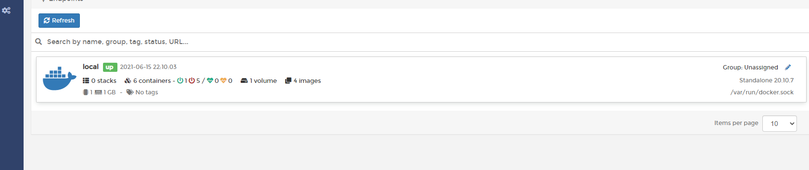
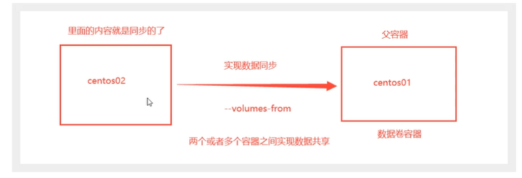
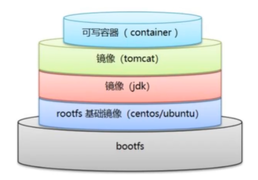
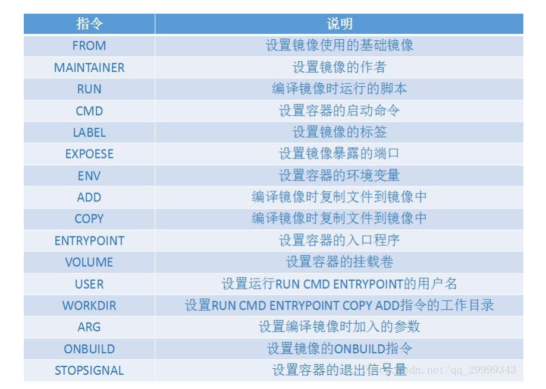
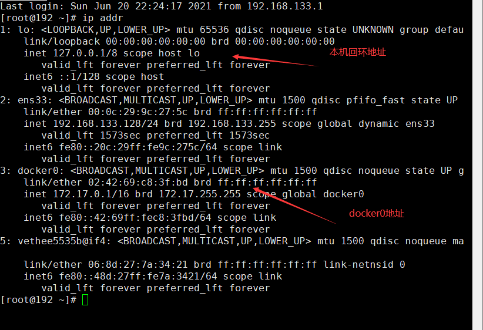
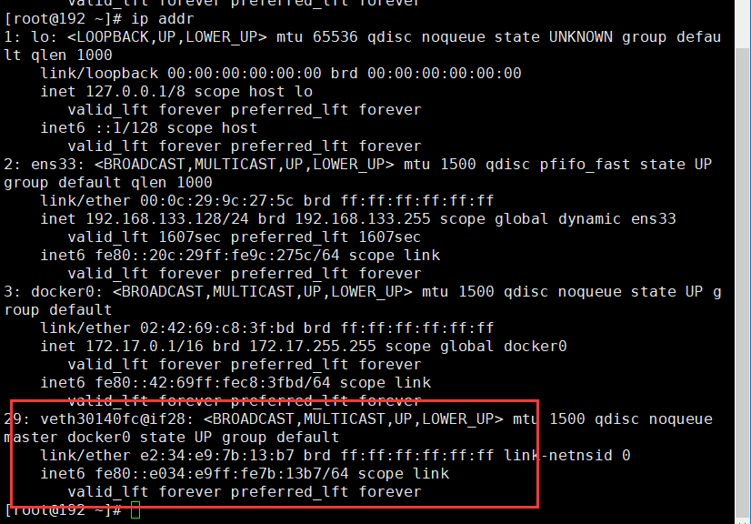
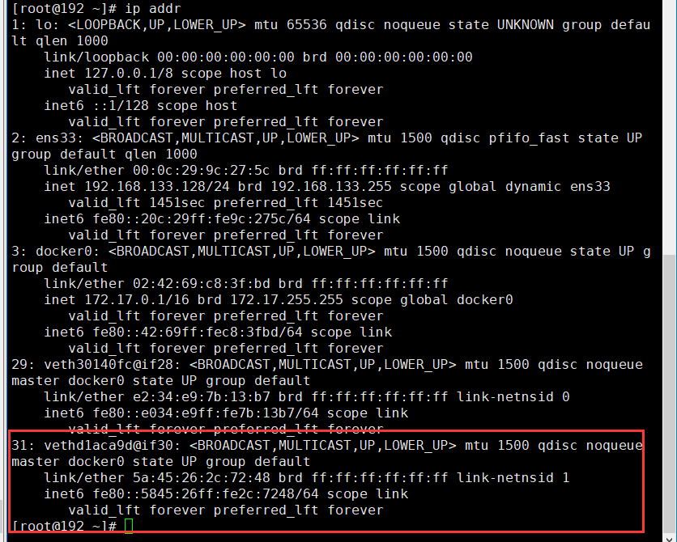
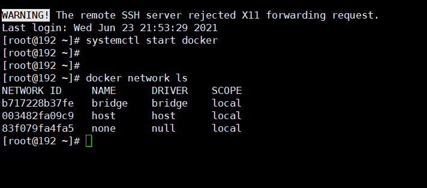

#  Docker的常用命令

## 帮助命令

```shell
docker version	  	  # 显示Docker的版本信息
docker info			  # 显示docker的系统信息，包括镜像和容器的数量
docker 命令 --help 	 # 万能命令
```

帮助文档地址：https://docs.docker.com/engine/api/v1.41/#


## 镜像命令

**docker images**  查看所有本地的镜像

```shell
[root@192 ~]# docker images
REPOSITORY    TAG       IMAGE ID       CREATED        SIZE
nginx         latest    d1a364dc548d   2 weeks ago    133MB
hello-world   latest    d1165f221234   3 months ago   13.3kB

# 解释
REPOSITORY	镜像的仓库源
TAG			镜像的标签
IMAGE ID	镜像的ID
CREATED		镜像的创建时间
SIZE		镜像的大小

# 可选项
Options:
  -a, --all             # 列出所有的镜像
      --digests         Show digests
  -f, --filter filter   Filter output based on conditions provided
      --format string   Pretty-print images using a Go template
      --no-trunc        Don't truncate output
  -q, --quiet          # 只显示镜像的ID


```


**docker search 搜索镜像**

```shell
NAME                               DESCRIPTION                                     STARS     OFFICIAL   AUTOMATED
nginx                              Official build of Nginx.                        15005     [OK]       
jwilder/nginx-proxy                Automated Nginx reverse proxy for docker con…   2035                 [OK]
richarvey/nginx-php-fpm            Container running Nginx + PHP-FPM capable of…   814                  [OK]
jc21/nginx-proxy-manager           Docker container for managing Nginx proxy ho…   199                  
linuxserver/nginx                  An Nginx container, brought to you by LinuxS…   147                  
tiangolo/nginx-rtmp                Docker image with Nginx using the nginx-rtmp…   130                  [OK]
jlesage/nginx-proxy-manager        Docker container for Nginx Proxy Manager        118                  [OK]
alfg/nginx-rtmp                    NGINX, nginx-rtmp-module and FFmpeg from sou…   99                   [OK]
bitnami/nginx                      Bitnami nginx Docker Image                      97                   [OK]
jasonrivers/nginx-rtmp             Docker images to host RTMP streams using NGI…   90                   [OK]
nginxdemos/hello                   NGINX webserver that serves a simple page co…   70                   [OK]


# 可选项， 根据STARS过滤
--filter=STARS=3000 # 搜索出STARS大于3000的
```

**docker pull 下载镜像**

```shell
# 下载镜像 docker pull 镜像名[:tag]

[root@192 ~]# docker pull mysql
Using default tag: latest	# 如果不写tag, 默认是latest
latest: Pulling from library/mysql
69692152171a: Already exists 
1651b0be3df3: Pull complete 	# 分层下载，docker image的核心 联合文件系统
951da7386bc8: Pull complete 
0f86c95aa242: Pull complete 
37ba2d8bd4fe: Pull complete 
6d278bb05e94: Pull complete 
497efbd93a3e: Pull complete 
f7fddf10c2c2: Pull complete 
16415d159dfb: Pull complete 
0e530ffc6b73: Pull complete 
b0a4a1a77178: Pull complete 
cd90f92aa9ef: Pull complete 
Digest: sha256:d50098d7fcb25b1fcb24e2d3247cae3fc55815d64fec640dc395840f8fa80969	# 签名
Status: Downloaded newer image for mysql:latest
docker.io/library/mysql:latest	# 真实地址

#指定版本
[root@192 ~]# docker pull mysql:5.7

```

**docker rmi 删除镜像**

```shell
[root@192 ~]# docker rmi -f c0cdc95609f1	# 删除指定镜像

Untagged: mysql:latest
Untagged: mysql@sha256:d50098d7fcb25b1fcb24e2d3247cae3fc55815d64fec640dc395840f8fa80969
Deleted: sha256:c0cdc95609f1fc1daf2c7cae05ebd6adcf7b5c614b4f424949554a24012e3c09
Deleted: sha256:137bebc5ea278e61127e13cc7312fd83874cd19e392ee87252b532f0162fbd56
Deleted: sha256:7ed0de2ad4e43c97f58fa9e81fba73700167ef9f8a9970685059e0109749a56b
Deleted: sha256:9375660fbff871cd29c86b8643be60e376bfc96e99a3d7e8f93d74cd61500705
Deleted: sha256:d8a47065d005ac34d81017677330ce096eb5562eeb971e2db12b0e200fdb1cb6
Deleted: sha256:ca13c8ad9df5d824d5a259a927eaa6c04a60f022bc2abe8fc7866cf4b2b366f4
Deleted: sha256:7af1865d5c19316c3dc0829a2ee2b3a744ae756f7fec9c213d3afc5f1f6ed306
Deleted: sha256:f205c8f3c8aaa6376442b34c0c2062738461d37e0aa16ba021cd7e09c67213c2
Deleted: sha256:d690e8a8242cf13cbe98c5b2faffdd0fc7e6c4c13425b5da31de991aa1f89a76
Deleted: sha256:24efeee958e9f3d859fe15540e9296d5aaa6d3eb3b5f5494a2e8370608a4cfaa
Deleted: sha256:654f2ffede3bb536fd62d04c9c7b7826e890828bec92182634e38684959b2498
Deleted: sha256:de478a06eaa676052e665faa0b07d86a007f4b87cf82eb46a258742dc2d32260
[root@192 ~]# docker rmi -f 容器id1 容器id2	# 删除多个镜像
[root@192 ~]# docker rmi -f $(docker images -aq)	# 删除所有镜像
```


## 容器命令

说明: 有了镜像才能创建容器

```shell
docker pull centos
```

**新建容器并启动**

```shell
docker run [可选参数] image
# 参数说明
--name="容器名"	  # 如--name="nginx1"
-d					# 后台方式启动
-it					# 使用交互方式运行， 进入容器查看内容
-p					# 指定容器端口 -p 8080:8080
	-p	# 主机端口:容器端口（常用）
	-p	# 容器端口
-P					# 随机端口


[root@192 docker]# docker run -it centos /bin/bash # 启动并进入容器
[root@97b4673d4c3c /]# exit 	# 从容器中退出容器
exit
```

**列出正在运行的容器**

```shell
# docker ps 命令
-a 		# 列出所有状态的容器
-n=? 	# 显示指定个数容器
-q		# 只显示容器的ID

[root@192 docker]# docker ps 
CONTAINER ID   IMAGE     COMMAND   CREATED   STATUS    PORTS     NAMES
[root@192 docker]# docker ps -a 
CONTAINER ID   IMAGE     COMMAND                  CREATED         STATUS                     PORTS     NAMES
97b4673d4c3c   centos    "/bin/bash"              4 minutes ago   Exited (0) 3 minutes ago             hungry_hofstadter
645fba19ade2   nginx     "/docker-entrypoint.…"   8 hours ago     Exited (0) 8 minutes ago             nice_colden
27a58d177e1d   nginx     "/docker-entrypoint.…"   8 hours ago     Exited (0) 8 hours ago               agitated_blackburn
[root@192 docker]# docker ps -aq
97b4673d4c3c
645fba19ade2
27a58d177e1d


```

**退出容器**

```shell
exit		# 直接退出容器并停止
ctrl + p + q# 容器不停止退出	
```

**删除容器**

```shell
docker rm 容器id	# 删除指定ID的容器， 不能删除正在运行的容器 如果需要删除运行的容器 -f
docker rm -f $(docker ps -aq) # 删除所有容器
```

**启动和停止容器**

```shell
docker start 容器Id	# 启动容器
docker restart 容器Id # 重启容器
docker stop 容器Id	# 停止容器
docker kill 容器Id	# 强制停止容器
```

## 常用其他命令

**后台启动容器**

```shell
# 命令 docker run -d 镜像名
[root@192 docker]# docker run -d centos
fc46a3d049c13efe65a3c6e03a1894803a152f4e8859529ce7f358d7fc3900c4

# 问题docker ps : 发现centos 已经停止
# 常见的坑：docker容器使用后台运行，就必须要有一个前台进程 ，docker没有发现应用，就会自动停止
```

**查看日志**

```shell
docker logs 
[root@192 docker]# docker logs --help

Usage:  docker logs [OPTIONS] CONTAINER

Fetch the logs of a container

Options:
      --details        Show extra details provided to logs
  -f, --follow         Follow log output
      --since string   Show logs since timestamp (e.g. 2013-01-02T13:23:37Z) or relative (e.g. 42m for 42 minutes)
  -n, --tail string    Number of lines to show from the end of the logs (default "all")
  -t, --timestamps     Show timestamps
      --until string   Show logs before a timestamp (e.g. 2013-01-02T13:23:37Z) or relative (e.g. 42m for 42 minutes)


```

**查看容器中的进程信息**

```shell
top 命令
[root@192 docker]# docker top 69b3efb40c1a
UID                 PID                 PPID                C                   STIME               TTY                 TIME                CMD
root                3449                3429                0                   22:22               pts/0               00:00:00            /bin/bash
```

**查看镜像元数据**

```shell
[root@192 docker]# docker inspect --help 

Usage:  docker inspect [OPTIONS] NAME|ID [NAME|ID...]

Return low-level information on Docker objects

Options:
  -f, --format string   Format the output using the given Go template
  -s, --size            Display total file sizes if the type is container
      --type string     Return JSON for specified type
[
    {
        "Id": "69b3efb40c1a21d275215a2fdce2b3099a6097318b0574393b7521d58253b903",
        "Created": "2021-06-14T14:12:03.66777241Z",
        "Path": "/bin/bash",
        "Args": [],
        "State": {
            "Status": "running",
            "Running": true,
            "Paused": false,
            "Restarting": false,
            "OOMKilled": false,
            "Dead": false,
            "Pid": 3449,
            "ExitCode": 0,
            "Error": "",
            "StartedAt": "2021-06-14T14:22:38.178649844Z",
            "FinishedAt": "2021-06-14T14:17:37.827369488Z"
        },
        "Image": "sha256:300e315adb2f96afe5f0b2780b87f28ae95231fe3bdd1e16b9ba606307728f55",
        "ResolvConfPath": "/var/lib/docker/containers/69b3efb40c1a21d275215a2fdce2b3099a6097318b0574393b7521d58253b903/resolv.conf",
        "HostnamePath": "/var/lib/docker/containers/69b3efb40c1a21d275215a2fdce2b3099a6097318b0574393b7521d58253b903/hostname",
        "HostsPath": "/var/lib/docker/containers/69b3efb40c1a21d275215a2fdce2b3099a6097318b0574393b7521d58253b903/hosts",
        "LogPath": "/var/lib/docker/containers/69b3efb40c1a21d275215a2fdce2b3099a6097318b0574393b7521d58253b903/69b3efb40c1a21d275215a2fdce2b3099a6097318b0574393b7521d58253b903-json.log",
        "Name": "/vibrant_faraday",
        "RestartCount": 0,
        "Driver": "overlay2",
        "Platform": "linux",
        "MountLabel": "",
        "ProcessLabel": "",
        "AppArmorProfile": "",
        "ExecIDs": null,
        "HostConfig": {
            "Binds": null,
            "ContainerIDFile": "",
            "LogConfig": {
                "Type": "json-file",
                "Config": {}
            },
            "NetworkMode": "default",
            "PortBindings": {},
            "RestartPolicy": {
                "Name": "no",
                "MaximumRetryCount": 0
            },
            "AutoRemove": false,
            "VolumeDriver": "",
            "VolumesFrom": null,
            "CapAdd": null,
            "CapDrop": null,
            "CgroupnsMode": "host",
            "Dns": [],
            "DnsOptions": [],
            "DnsSearch": [],
            "ExtraHosts": null,
            "GroupAdd": null,
            "IpcMode": "private",
            "Cgroup": "",
            "Links": null,
            "OomScoreAdj": 0,
            "PidMode": "",
            "Privileged": false,
            "PublishAllPorts": false,
            "ReadonlyRootfs": false,
            "SecurityOpt": null,
            "UTSMode": "",
            "UsernsMode": "",
            "ShmSize": 67108864,
            "Runtime": "runc",
            "ConsoleSize": [
                0,
                0
            ],
            "Isolation": "",
            "CpuShares": 0,
            "Memory": 0,
            "NanoCpus": 0,
            "CgroupParent": "",
            "BlkioWeight": 0,
            "BlkioWeightDevice": [],
            "BlkioDeviceReadBps": null,
            "BlkioDeviceWriteBps": null,
            "BlkioDeviceReadIOps": null,
            "BlkioDeviceWriteIOps": null,
            "CpuPeriod": 0,
            "CpuQuota": 0,
            "CpuRealtimePeriod": 0,
            "CpuRealtimeRuntime": 0,
            "CpusetCpus": "",
            "CpusetMems": "",
            "Devices": [],
            "DeviceCgroupRules": null,
            "DeviceRequests": null,
            "KernelMemory": 0,
            "KernelMemoryTCP": 0,
            "MemoryReservation": 0,
            "MemorySwap": 0,
            "MemorySwappiness": null,
            "OomKillDisable": false,
            "PidsLimit": null,
            "Ulimits": null,
            "CpuCount": 0,
            "CpuPercent": 0,
            "IOMaximumIOps": 0,
            "IOMaximumBandwidth": 0,
            "MaskedPaths": [
                "/proc/asound",
                "/proc/acpi",
                "/proc/kcore",
                "/proc/keys",
                "/proc/latency_stats",
                "/proc/timer_list",
                "/proc/timer_stats",
                "/proc/sched_debug",
                "/proc/scsi",
                "/sys/firmware"
            ],
            "ReadonlyPaths": [
                "/proc/bus",
                "/proc/fs",
                "/proc/irq",
                "/proc/sys",
                "/proc/sysrq-trigger"
            ]
        },
        "GraphDriver": {
            "Data": {
                "LowerDir": "/var/lib/docker/overlay2/5cca27f4b452c53586640606fcb817b4f9ea4a7bc8904baeadbd8a8a236c28fb-init/diff:/var/lib/docker/overlay2/084b3f6802cb2b2bf0e0621520d3c5e9e8d02854b29a012eeb406e5ce1e584b4/diff",
                "MergedDir": "/var/lib/docker/overlay2/5cca27f4b452c53586640606fcb817b4f9ea4a7bc8904baeadbd8a8a236c28fb/merged",
                "UpperDir": "/var/lib/docker/overlay2/5cca27f4b452c53586640606fcb817b4f9ea4a7bc8904baeadbd8a8a236c28fb/diff",
                "WorkDir": "/var/lib/docker/overlay2/5cca27f4b452c53586640606fcb817b4f9ea4a7bc8904baeadbd8a8a236c28fb/work"
            },
            "Name": "overlay2"
        },
        "Mounts": [],
        "Config": {
            "Hostname": "69b3efb40c1a",
            "Domainname": "",
            "User": "",
            "AttachStdin": true,
            "AttachStdout": true,
            "AttachStderr": true,
            "Tty": true,
            "OpenStdin": true,
            "StdinOnce": true,
            "Env": [
                "PATH=/usr/local/sbin:/usr/local/bin:/usr/sbin:/usr/bin:/sbin:/bin"
            ],
            "Cmd": [
                "/bin/bash"
            ],
            "Image": "centos",
            "Volumes": null,
            "WorkingDir": "",
            "Entrypoint": null,
            "OnBuild": null,
            "Labels": {
                "org.label-schema.build-date": "20201204",
                "org.label-schema.license": "GPLv2",
                "org.label-schema.name": "CentOS Base Image",
                "org.label-schema.schema-version": "1.0",
                "org.label-schema.vendor": "CentOS"
            }
        },
        "NetworkSettings": {
            "Bridge": "",
            "SandboxID": "c4e99337b9f348725732b6d0fd5e62b6c8708836a9c9f1a6cd3bb2e3b92374c3",
            "HairpinMode": false,
            "LinkLocalIPv6Address": "",
            "LinkLocalIPv6PrefixLen": 0,
            "Ports": {},
            "SandboxKey": "/var/run/docker/netns/c4e99337b9f3",
            "SecondaryIPAddresses": null,
            "SecondaryIPv6Addresses": null,
            "EndpointID": "ea1703d89129a6e3f1a75e5f4c33687b230670af5d1c2da0a79ad35b770fe3a8",
            "Gateway": "172.17.0.1",
            "GlobalIPv6Address": "",
            "GlobalIPv6PrefixLen": 0,
            "IPAddress": "172.17.0.2",
            "IPPrefixLen": 16,
            "IPv6Gateway": "",
            "MacAddress": "02:42:ac:11:00:02",
            "Networks": {
                "bridge": {
                    "IPAMConfig": null,
                    "Links": null,
                    "Aliases": null,
                    "NetworkID": "2c94abc4712d60b0e79184205fbfae537959171cb5fbd8bc4a558a2be4af8731",
                    "EndpointID": "ea1703d89129a6e3f1a75e5f4c33687b230670af5d1c2da0a79ad35b770fe3a8",
                    "Gateway": "172.17.0.1",
                    "IPAddress": "172.17.0.2",
                    "IPPrefixLen": 16,
                    "IPv6Gateway": "",
                    "GlobalIPv6Address": "",
                    "GlobalIPv6PrefixLen": 0,
                    "MacAddress": "02:42:ac:11:00:02",
                    "DriverOpts": null
                }
            }
        }
    }
]


```

**进入当前正在运行的容器**

```shell
# 我们通常容器都是使用后台方式运行的， 需要进入容器，修改一些配置
# 命令
docker -it exec 容器id
[root@192 docker]# docker ps 
CONTAINER ID   IMAGE     COMMAND       CREATED          STATUS         PORTS     NAMES
69b3efb40c1a   centos    "/bin/bash"   18 minutes ago   Up 7 minutes             vibrant_faraday
[root@192 docker]# docker exec -it 69b3efb40c1a /bin/bash

# 方式二
docker attach 容器id
[root@192 docker]# docker attach --help 

Usage:  docker attach [OPTIONS] CONTAINER

Attach local standard input, output, and error streams to a running container

Options:
      --detach-keys string   Override the key sequence for detaching a container
      --no-stdin             Do not attach STDIN
      --sig-proxy            Proxy all received signals to the process (default true)
[root@192 docker]# docker attach 69b3efb40c1a 
正在执行当前的代码...
# docker exec		# 进入容器后并开启一个新的终端
# docker attach		# 进入容器正在运行的终端， 不会启动新的进程
```

**从容器中拷贝文件**

```shell
# docker cp 容器id:容器内路径 目的的主机路径

[root@192 docker]# docker attach 69b3efb40c1a 
[root@69b3efb40c1a /]# 
[root@69b3efb40c1a /]# ll
bash: ll: command not found
[root@69b3efb40c1a /]# ls 
bin  dev  etc  home  lib  lib64  lost+found  media  mnt  opt  proc  root  run  sbin  srv  sys  tmp  usr  var
[root@69b3efb40c1a /]# cd usr  
[root@69b3efb40c1a usr]# ls 
bin  games  include  lib  lib64  libexec  local  sbin  share  src  tmp
[root@69b3efb40c1a usr]# cd local
[root@69b3efb40c1a local]# touch xxx.java
[root@69b3efb40c1a local]# ls 
bin  etc  games  include  lib  lib64  libexec  sbin  share  src  xxx.java
[root@69b3efb40c1a local]# read escape sequence
[root@192 docker]# docker ps 
CONTAINER ID   IMAGE     COMMAND       CREATED          STATUS          PORTS     NAMES
69b3efb40c1a   centos    "/bin/bash"   25 minutes ago   Up 15 minutes             vibrant_faraday
[root@192 docker]# docker cp 69b3efb40c1a:/usr/local/xxx.java /usr/local/
[root@192 docker]# 
[root@192 docker]# 
[root@192 docker]# cd /usr/local/
[root@192 local]# ll
total 0
drwxr-xr-x. 5 root root 263 Mar  4 14:18 bin
drwxr-xr-x. 2 root root   6 Apr 11  2018 etc
drwxr-xr-x. 2 root root   6 Apr 11  2018 games
drwxr-xr-x. 2 root root   6 Apr 11  2018 include
drwxr-xr-x. 2 root root   6 Apr 11  2018 lib
drwxr-xr-x. 2 root root   6 Apr 11  2018 lib64
drwxr-xr-x. 2 root root   6 Apr 11  2018 libexec
drwxr-xr-x. 2 root root   6 Apr 11  2018 sbin
drwxr-xr-x. 5 root root  49 Dec 23  2019 share
drwxr-xr-x. 3 root root  51 Jul 19  2020 src
-rw-r--r--. 1 root root   0 Jun 14 22:37 xxx.java
[root@192 local]# 


# 拷贝是一个手动过程，可以使用-v 卷的技术可以实现自动同步
```

## 小结


## 可视化

**portainer**

```shell
docker run -d -p 8000:8000 -p 9000:9000 --name=portainer --restart=always -v /var/run/docker.sock:/var/run/docker.sock -v portainer_data:/data portainer/portainer-ce

```

**Rancher（CI/CD再用）**

**什么是portainer?**

Docker 图形化界面管理工具！ 提供一个后台操作

```shell
访问测试[root@192 ~]# docker run -d -p 8000:8000 -p 9000:9000 --name=portainer --restart=always -v /var/run/docker.sock:/var/run/docker.sock -v portainer_data:/data portainer/portainer-ce
Unable to find image 'portainer/portainer-ce:latest' locally
latest: Pulling from portainer/portainer-ce
94cfa856b2b1: Pull complete 
49d59ee0881a: Pull complete 
3fc1bc38fb56: Pull complete 
Digest: sha256:f133bfdd9646f48a8ddb54b9555070f628caa530924045eeff8144a32de2dcc7
Status: Downloaded newer image for portainer/portainer-ce:latest
eb49ac378dacc26e8e2e329902c81ad29cc5b652e29c4c48801334926bf4b30e

访问测试
http://192.168.133.128:9000
通过它访问：

```



可视化面板一般不用

# Docker镜像讲解

## commit镜像

```shell
docker commit 提交容器成为一个新的副本

docker commit -m="描述信息" -a="作者" 容器Id 目标镜像名:[TAG]
```

实战测试

```shell
# 启动一个默认的tomcat

# 发现这个默认的tomcat webapps 下没文件

# 从webapps.dist 中拷贝文件进webapps
[root@192 ~]# docker commit -a 'ym' -m 'changed tomcat' 3c2d78a3499c tomcat_ym:1.0
sha256:294abe6c038221a82fad986f05b44258ca830b7af0a7f9a4bff445077e0242f3

[root@192 ~]# docker images
REPOSITORY               TAG       IMAGE ID       CREATED         SIZE
tomcat_ym                1.0       294abe6c0382   3 seconds ago   672MB
portainer/portainer-ce   latest    45be17a5903a   2 weeks ago     209MB
nginx                    latest    d1a364dc548d   2 weeks ago     133MB
tomcat                   latest    c43a65faae57   4 weeks ago     667MB
hello-world              latest    d1165f221234   3 months ago    13.3kB
centos                   latest    300e315adb2f   6 months ago    209MB

```


# 容器数据卷

## 什么是容器数据卷

docker理念回顾

将应用和环境打包成一个镜像

如果数据放在容器中， 删容器等于 删库

希望容器之间有个数据共享的技术

目录的挂载，将容器内目录挂载到宿主机，容器间也可以共享


## 使用数据卷

> 方式一：直接使用命令来挂载 -v

```shell
docker run -it -v 主机目录:容器内目录

root@192 ~]# docker run -itd -v /home/test/centos/home:/home centos
7847d14ca3ff74f0c7a1d024db74bfe0f38a6fb021233165cd5e20232002d482
[root@192 ~]# docker ps
CONTAINER ID   IMAGE                    COMMAND        CREATED         STATUS         PORTS                                                                                  NAMES
7847d14ca3ff   centos                   "/bin/bash"    4 seconds ago   Up 3 seconds                                                                                          fervent_hofstadter
eb49ac378dac   portainer/portainer-ce   "/portainer"   3 days ago      Up 6 minutes   0.0.0.0:8000->8000/tcp, :::8000->8000/tcp, 0.0.0.0:9000->9000/tcp, :::9000->9000/tcp   portainer

# 检查是否挂载成功
[root@192 home]# docker inspect 784
[
    {
        "Id": "7847d14ca3ff74f0c7a1d024db74bfe0f38a6fb021233165cd5e20232002d482",
        "Created": "2021-06-19T08:11:57.888037364Z",
        "Path": "/bin/bash",
        "Args": [],
		...........
		
		"Mounts": [
            {
                "Type": "bind",
                "Source": "/home/test/centos/home",
                "Destination": "/home",
                "Mode": "",
                "RW": true,
                "Propagation": "rprivate"
            }
        ],
		.........
# 如果挂载成功后，当容器停止、删除后数据依然存在 且相同目录重新挂载镜像仍然存在
# 会覆盖容器内文件

# 启动MySQL镜像
-d：后台运行
-p: 端口映射
-v：数据卷挂载
-e: 环境变量配置
--name: 容器名称
[root@192 ~]# docker run --name mysql01 -v /home/test/mysql/conf:/etc/mysql/conf.d -v /home/test/mysql/data:/var/lib/mysql -e MYSQL_ROOT_PASSWORD=root -d -p 3310:3306 mysql:5.7
b9410c3f68d64aec13e58f980454e47728c97ca3d0d7ca64a8f7c3698716bcfe

[root@192 ~]# cd /home/test/mysql/
[root@192 mysql]# ll
total 4
drwxr-xr-x. 2 root    root    6 Jun 19 16:52 conf
drwxr-xr-x. 5 polkitd root 4096 Jun 19 16:52 data
[root@192 mysql]# cd data/
[root@192 data]# ll
total 188484
-rw-r-----. 1 polkitd input       56 Jun 19 16:52 auto.cnf
-rw-------. 1 polkitd input     1680 Jun 19 16:52 ca-key.pem
-rw-r--r--. 1 polkitd input     1112 Jun 19 16:52 ca.pem
-rw-r--r--. 1 polkitd input     1112 Jun 19 16:52 client-cert.pem
-rw-------. 1 polkitd input     1676 Jun 19 16:52 client-key.pem
-rw-r-----. 1 polkitd input     1359 Jun 19 16:52 ib_buffer_pool
-rw-r-----. 1 polkitd input 79691776 Jun 19 16:52 ibdata1
-rw-r-----. 1 polkitd input 50331648 Jun 19 16:52 ib_logfile0
-rw-r-----. 1 polkitd input 50331648 Jun 19 16:52 ib_logfile1
-rw-r-----. 1 polkitd input 12582912 Jun 19 16:52 ibtmp1
drwxr-x---. 2 polkitd input     4096 Jun 19 16:52 mysql
drwxr-x---. 2 polkitd input     8192 Jun 19 16:52 performance_schema
-rw-------. 1 polkitd input     1676 Jun 19 16:52 private_key.pem
-rw-r--r--. 1 polkitd input      452 Jun 19 16:52 public_key.pem
-rw-r--r--. 1 polkitd input     1112 Jun 19 16:52 server-cert.pem
-rw-------. 1 polkitd input     1680 Jun 19 16:52 server-key.pem
drwxr-x---. 2 polkitd input     8192 Jun 19 16:52 sys

```


## 具名和匿名挂载

```shell
# 匿名挂载
-v: 容器内路径
[root@192 html]# docker run -d --name nginx02 -v /etc/nginx nginx

# 查看数据卷挂载信息
[root@192 data]# docker volume ls
DRIVER    VOLUME NAME
local     9586ce8c8e5bd8533c414782ea532cc8e6a723e068777132a43b5bd8ae88d3cf
local     34036b4b624ff1da6e37757a8cc50444d8776b441c87c6dbaa6fcd02965076f4
local     bb631b12c65260dc4eb2d3e4743c5905977e5a136e7413cac5b31e8ce93a96cb
local     portainer_data

# 具名挂载
[root@192 html]# docker run -d  -P -v namedNginx:/etc/nginx --name nginx03 nginx
[root@192 html]# docker volume ls
DRIVER    VOLUME NAME
local     9586ce8c8e5bd8533c414782ea532cc8e6a723e068777132a43b5bd8ae88d3cf
local     34036b4b624ff1da6e37757a8cc50444d8776b441c87c6dbaa6fcd02965076f4
local     bb631b12c65260dc4eb2d3e4743c5905977e5a136e7413cac5b31e8ce93a96cb
local     namedNginx
local     portainer_data

[root@192 html]# docker volume inspect namedNginx 
[
    {
        "CreatedAt": "2021-06-19T17:07:00+08:00",
        "Driver": "local",
        "Labels": null,
        "Mountpoint": "/var/lib/docker/volumes/namedNginx/_data",
        "Name": "namedNginx",
        "Options": null,
        "Scope": "local"
    }
]

```

所有的docker 容器内的卷 没有指定目录的情况下 都是在 `/var/lib/docker/volumes/xxx/_data`

```shell
# 如何确定是具名挂载还是匿名挂载、还是指定路径挂载
-v 容器内路径 # 匿名挂载
-v 卷名：容器内路径 # 具名挂载
-v /宿主内路径：容器内路径 #指定路径挂载
```

```shell
# 通过 -v  容器内路径: ro/rw 改变读写权限
ro readonly  # 只读
rw readwrite # 可读可写

# 一旦这个设置了容器权限，容器对我们挂载出来的内容就有限定了!
```


# DockerFile

Dockerfile 就是用来构建Docker镜像的构建文件              

```shell
# 创建Dockerfile 名字可以随意
[root@192 test]# vim dockerfile
[root@192 test]# cat dockerfile 
FROM centos

VOLUME ["/volume01","/volume02"] #需写绝对命令

CMD echo "----------end---------"
CMD /bin/bash

# 每个命令就是一层

[root@192 test]# docker build -f dockerfile -t ym/centos:1.0 .
Sending build context to Docker daemon  207.2MB
Step 1/4 : FROM centos
 ---> 300e315adb2f
Step 2/4 : VOLUME ["/volume01","/volume02"]
 ---> Running in 2f200ac4980c
Removing intermediate container 2f200ac4980c
 ---> f4f256b0dc3e
Step 3/4 : CMD echo "----------end---------"
 ---> Running in 30139caa1c69
Removing intermediate container 30139caa1c69
 ---> 83fbbefb1732
Step 4/4 : CMD /bin/bash
 ---> Running in 7ef9955eca32
Removing intermediate container 7ef9955eca32
 ---> f7430385a8da
Successfully built f7430385a8da
Successfully tagged ym/centos:1.0
[root@192 test]# docker images
REPOSITORY               TAG       IMAGE ID       CREATED          SIZE
ym/centos                1.0       f7430385a8da   19 seconds ago   209MB
tomcat_ym                1.0       294abe6c0382   4 days ago       672MB
portainer/portainer-ce   latest    45be17a5903a   3 weeks ago      209MB
nginx                    latest    d1a364dc548d   3 weeks ago      133MB
tomcat                   latest    c43a65faae57   5 weeks ago      667MB
mysql                    5.7       2c9028880e58   5 weeks ago      447MB
hello-world              latest    d1165f221234   3 months ago     13.3kB
centos                   latest    300e315adb2f   6 months ago     209MB
[root@192 test]# docker ps


```


```shell
# 运行自己的容器
[root@192 test]# docker run -itd ym/centos:1.0 /bin/bash
# 进入容器内部 查看卷
[root@bb6226686330 /]# ls -l
total 0
lrwxrwxrwx.   1 root root   7 Nov  3  2020 bin -> usr/bin
drwxr-xr-x.   5 root root 360 Jun 19 14:19 dev
...
drwxr-xr-x.   2 root root  25 Jun 19 14:21 volume01
drwxr-xr-x.   2 root root  25 Jun 19 14:22 volume02
# 检查是否挂载成功
[root@192 _data]# docker inspect bb62
[
   ...
        "Mounts": [
            {
                "Type": "volume",
                "Name": "f5562c12a290acf225f846e82e9681fd18f98887281bd5c0c972ee2c40145c4c",
                "Source": "/var/lib/docker/volumes/f5562c12a290acf225f846e82e9681fd18f98887281bd5c0c972ee2c40145c4c/_data",
                "Destination": "/volume01",
                "Driver": "local",
                "Mode": "",
                "RW": true,
                "Propagation": ""
            },
            {
                "Type": "volume",
                "Name": "3797f4a6585917b743b08edae70a73101e9efcda584c8178866c208310af2aa3",
                "Source": "/var/lib/docker/volumes/3797f4a6585917b743b08edae70a73101e9efcda584c8178866c208310af2aa3/_data",
                "Destination": "/volume02",
                "Driver": "local",
                "Mode": "",
                "RW": true,
                "Propagation": ""
            }
        ],

```


## 数据卷容器

多个MySQL同步数据



```shell
# 运行第一个容器
[root@192 _data]# docker run -it --name centos01 ym/centos:1.0 /bin/bash

# 运行后面同步卷的容器
[root@192 _data]# docker run -it --volumes-from  centos01 --name centos02  ym/centos:1.0 /bin/bash
[root@192 _data]# docker run -it --volumes-from  centos01 --name centos03  ym/centos:1.0 /bin/bash
# 挂载匿名数据卷的地址都是一致的
```

结论：

容器之间配置信息的传递，数据卷容器的生命周期 一直持续到没有容器使用位置


## DockerFIle构建过程

**基础知识**

1、每个保留关键字 都是必须为大写字母

2、执行从上到下

3、#表示注释

4、每个指令都会创建提交一个新的镜像层



DockerFile 是面向开发的，作镜像就是要编写DockerFile文件

Docker镜像逐渐成为企业交付标准

DockerFile：构建文件，定义了一切的步骤，源代码

DockerImages:  通过DockerFile 构建生成的镜像，最终发布和运行的产品

Docker容器：容器是由镜像运行而来

## DockerFile的指令



> 创建一个自己的Centos

```shell
# 编写 dockerfile
[root@192 test]# cat dockerfile
FROM centos
MAINTAINER ym<526062864@qq.com>

ENV MYPATH /usr/local
WORKDIR $MYPATH	

RUN yum -y install vim
RUN yum -y install net-tools
EXPOSE 80
CMD echo $MYPATH
CMD echo "----------end---------"
CMD /bin/bash

# 通过文件构建镜像
[root@192 test]# docker build -f dockerfile -t ym/centos .

[root@192 test]# docker run  -itd  ym/centos /bin/bash
d8ab982e09e2e95b6406d2f443eeb7852b4c60f6d156814e7d16ac671dc6c94b
[root@192 test]# docker ps
CONTAINER ID   IMAGE                    COMMAND        CREATED         STATUS          PORTS                                                                                  NAMES
d8ab982e09e2   ym/centos                "/bin/bash"    5 seconds ago   Up 3 seconds    80/tcp                                                                                 vigorous_lederberg
eb49ac378dac   portainer/portainer-ce   "/portainer"   4 days ago      Up 34 minutes   0.0.0.0:8000->8000/tcp, :::8000->8000/tcp, 0.0.0.0:9000->9000/tcp, :::9000->9000/tcp   portainer
[root@192 test]# docker attach d8ab
[root@d8ab982e09e2 local]# pwd 已经进入了设置的Path
/usr/local
[root@d8ab982e09e2 local]# ifconfig
eth0: flags=4163<UP,BROADCAST,RUNNING,MULTICAST>  mtu 1500
        inet 172.17.0.3  netmask 255.255.0.0  broadcast 172.17.255.255
        ether 02:42:ac:11:00:03  txqueuelen 0  (Ethernet)
        RX packets 8  bytes 656 (656.0 B)
        RX errors 0  dropped 0  overruns 0  frame 0
        TX packets 0  bytes 0 (0.0 B)
        TX errors 0  dropped 0 overruns 0  carrier 0  collisions 0

lo: flags=73<UP,LOOPBACK,RUNNING>  mtu 65536
        inet 127.0.0.1  netmask 255.0.0.0
        loop  txqueuelen 1000  (Local Loopback)
        RX packets 0  bytes 0 (0.0 B)
        RX errors 0  dropped 0  overruns 0  frame 0
        TX packets 0  bytes 0 (0.0 B)
        TX errors 0  dropped 0 overruns 0  carrier 0  collisions 0

[root@d8ab982e09e2 local]# vim xxx

```

我们列出本地镜像的变更历史

```shell
[root@192 test]# docker history  ym/centos
IMAGE          CREATED          CREATED BY                                      SIZE      COMMENT
7c196f4e622b   37 minutes ago   /bin/sh -c #(nop)  CMD ["/bin/sh" "-c" "/bin…   0B        
e5a211b7ca69   37 minutes ago   /bin/sh -c #(nop)  CMD ["/bin/sh" "-c" "echo…   0B        
2c28d72fd998   37 minutes ago   /bin/sh -c #(nop)  CMD ["/bin/sh" "-c" "echo…   0B        
c835c90cf5b1   37 minutes ago   /bin/sh -c #(nop)  EXPOSE 80                    0B        
d7b9ee02ea54   37 minutes ago   /bin/sh -c yum -y install net-tools             24.9MB    
3672a43ad344   37 minutes ago   /bin/sh -c yum -y install vim                   60.7MB    
e624677500c6   37 minutes ago   /bin/sh -c #(nop) WORKDIR /usr/local            0B        
81cfed33445c   37 minutes ago   /bin/sh -c #(nop)  ENV MYPATH=/usr/local        0B        
560b004e46ed   37 minutes ago   /bin/sh -c #(nop)  MAINTAINER ym<526062864@q…   0B        
300e315adb2f   6 months ago     /bin/sh -c #(nop)  CMD ["/bin/bash"]            0B        
<missing>      6 months ago     /bin/sh -c #(nop)  LABEL org.label-schema.sc…   0B        
<missing>      6 months ago     /bin/sh -c #(nop) ADD file:bd7a2aed6ede423b7…   209MB   
```


> CMD  和 ENTRYPOINT的区别

```shell
CMD:
ENTRYPOINT:

[root@192 test]# cat dockerfile-cmd 
FROM centos
CMD ["ls", "-a"]

# 运行时 执行 CMD 中的命令
[root@192 test]# docker run ym/centos/cmd
.
..
.dockerenv
bin
dev
etc
home
lib
lib64
lost+found
media
mnt
opt
proc
root
run
sbin
srv
sys
tmp
usr
var

# 想要追加命令 只能是完整命令
[root@192 test]# docker run ym/centos/cmd -l
docker: Error response from daemon: OCI runtime create failed: container_linux.go:380: starting container process caused: exec: "-l": executable file not found in $PATH: unknown.

[root@192 test]# docker run ym/centos/cmd ls -al
total 0
drwxr-xr-x.   1 root root   6 Jun 20 02:21 .
drwxr-xr-x.   1 root root   6 Jun 20 02:21 ..
-rwxr-xr-x.   1 root root   0 Jun 20 02:21 .dockerenv
lrwxrwxrwx.   1 root root   7 Nov  3  2020 bin -> usr/bin
drwxr-xr-x.   5 root root 340 Jun 20 02:21 dev
drwxr-xr-x.   1 root root  66 Jun 20 02:21 etc
drwxr-xr-x.   2 root root   6 Nov  3  2020 home
lrwxrwxrwx.   1 root root   7 Nov  3  2020 lib -> usr/lib
lrwxrwxrwx.   1 root root   9 Nov  3  2020 lib64 -> usr/li

[root@192 test]# cat dockerfile-entry 
FROM centos
ENTRYPOINT ["ls", "-a"]

[root@192 test]# docker build -f dockerfile-entry -t ym/centos/entry .
[root@192 test]# docker run ym/centos/entry 
.
..
.dockerenv
bin
dev
etc
home
lib
lib64
lost+found

# entrypoint 命令行追加命令，直接拼接在entrypoint命令后面
[root@192 test]# docker run ym/centos/entry -l
total 0
drwxr-xr-x.   1 root root   6 Jun 20 02:24 .
drwxr-xr-x.   1 root root   6 Jun 20 02:24 ..
-rwxr-xr-x.   1 root root   0 Jun 20 02:24 .dockerenv
lrwxrwxrwx.   1 root root   7 Nov  3  2020 bin -> usr/bin
drwxr-xr-x.   5 root root 340 Jun 20 02:24 dev
drwxr-xr-x.   1 root root  66 Jun 20 02:24 etc
drwxr-xr-x.   2 root root   6 Nov  3  2020 home
lrwxrwxrwx.   1 root root   7 Nov  3  2020 lib
```

DockerFile 许多命令十分相似，需理解其中的意思

## 实战：Tomcat镜像

1. 准备镜像文件 Tomcat ，jdk的压缩包

2. 编写DockerFile文件

3. 运行构建镜像

   ```shell
   [root@192 tomcat]# cat DockerFile 
   FROM centos
   MAINTAINER ym<526062864@qq.com>
   
   COPY readme.txt /usr/local/readme.txt
   
   ADD apache-tomcat-9.0.10.tar.gz /usr/local/
   ADD jdk-8u181-linux-x64.tar.gz /usr/local/
   RUN yum -y install vim
   
   ENV MYPATH /usr/local
   WORKDIR $MYPATH
   
   ENV JAVA_HOME /usr/local/jdk1.8.0_181
   ENV CLASSPATH $JAVA_HOME/lib/dt.jar:$JAVA_HOME/lib/tools.jar
   ENV CATALINA_HOME /usr/local/apache-tomcat-9.0.10
   ENV CATALINA_BASE /usr/local/apache-tomcat-9.0.10
   ENV PATH $PATH:$JAVA_HOME/bin:$CATALINA_HOME/lib:$CATALINA_HOME/bin
   
   EXPOSE 8080
   CMD /usr/local/apache-tomcat-9.0.10/bin/startup.sh && tail -f /usr/local/apache-tomcat-9.0.10/logs/catalina.out
   
   
   # 构建镜像
   docker build -t ym/tomcat .
   # 运行镜像
   docker run  -itd -p 8080:8080 -v /home/test/tomcat/build:/usr/local/apache-tomcat-9.0.10/webapps/test -v /home/test/tomcat/logs:/usr/local/apache-tomcat-9.0.10/logs --name tomcat01  ym/tomcat
   
   
   ```

   


# Docker 网络

## 理解Docker0

> 测试



``` shell
# Docker 是如何处理容器网络访问的

# 查看容器的内部网络地址 ip addr 发现容器启动的时候会有一个eth0@if29 docker分配的ip地址
[root@192 tomcat]# docker run -d tomcat
264a7273087396e24a1c0f86dd20cca06d11c02d5ee698371c6629efb5dbf7fb
[root@192 tomcat]# docker ps 
CONTAINER ID   IMAGE     COMMAND             CREATED         STATUS         PORTS      NAMES
264a72730873   tomcat    "catalina.sh run"   3 seconds ago   Up 2 seconds   8080/tcp   condescending_banach
[root@192 tomcat]# docker exec 264 ip addr 
1: lo: <LOOPBACK,UP,LOWER_UP> mtu 65536 qdisc noqueue state UNKNOWN group default qlen 1000
    link/loopback 00:00:00:00:00:00 brd 00:00:00:00:00:00
    inet 127.0.0.1/8 scope host lo
       valid_lft forever preferred_lft forever
28: eth0@if29: <BROADCAST,MULTICAST,UP,LOWER_UP> mtu 1500 qdisc noqueue state UP group default 
    link/ether 02:42:ac:11:00:02 brd ff:ff:ff:ff:ff:ff link-netnsid 0
    inet 172.17.0.2/16 brd 172.17.255.255 scope global eth0
       valid_lft forever preferred_lft forever
 # 问题： linux 可不可以ping通容器内部  可以
 [root@192 tomcat]# ping  172.17.0.2
PING 172.17.0.2 (172.17.0.2) 56(84) bytes of data.
64 bytes from 172.17.0.2: icmp_seq=1 ttl=64 time=0.107 ms
64 bytes from 172.17.0.2: icmp_seq=2 ttl=64 time=0.047 ms
^C
--- 172.17.0.2 ping statistics ---
2 packets transmitted, 2 received, 0% packet loss, time 1000ms
rtt min/avg/max/mdev = 0.047/0.077/0.107/0.030 ms


```

> 原理

1. 我们每启动一个docker容器， docker就会给docker容器分配一个ip, 我们只要安装了docker 就会有一个网卡docker0 桥接模式 使用的技术是evth-pair技术!

   



> 再启动一个 



```shell
# 我们发现这个容器带来的网卡 都是一对一对的
# veth-pair 就是一对的虚拟设备接口 都是成对出现的 一端连着协议，一端彼此相连
# 正因为有这个特性，veth-pair 充当一个桥梁 连接各种虚拟网络设备
# OpenStack，Docker容器之间的连接OVS的链接 都是veth-pair技术

# 容器之间是可以互相ping通

```


## 自定义网络

> 查看所有docker 网络



**网络模式**

bridge: 桥接 docker 搭桥（默认）

none: 不配置网络

host: 和宿主机共享网络

container:容器内网络连通（用得少）


**测试**

```shell
# 我们直接运行容器镜像的命令， --net bridge 这个就是我们的docker0
docker run -d -P --name tomcat01 tomcat

# docker0的特定 默认 域名不能访问

# 可以自定义网络
Commands:
  connect     Connect a container to a network
  create      Create a network
  disconnect  Disconnect a container from a network
  inspect     Display detailed information on one or more networks
  ls          List networks
  prune       Remove all unused networks
  rm          Remove one or more networks

Run 'docker network COMMAND --help' for more information on a command.


# --driver bridge
# --subnet 192.168.0.0/16 192.168.0.2 192.168.255.254
# --gateway 192.168.0.1
[root@192 ~]# docker network create --driver bridge --subnet 192.168.0.0/16 --gateway 192.168.0.1 mynet
ace7588b5c974454c7463bb184a60d4aacf38ae8a484d11efbe5fefe144aee08
[root@192 ~]# docker network ls
NETWORK ID     NAME      DRIVER    SCOPE
b717228b37fe   bridge    bridge    local
003482fa09c9   host      host      local
ace7588b5c97   mynet     bridge    local
83f079fa4fa5   none      null      local

[
    {
        "Name": "mynet",
        "Id": "ace7588b5c974454c7463bb184a60d4aacf38ae8a484d11efbe5fefe144aee08",
        "Created": "2021-06-23T22:07:15.425330582+08:00",
        "Scope": "local",
        "Driver": "bridge",
        "EnableIPv6": false,
        "IPAM": {
            "Driver": "default",
            "Options": {},
            "Config": [
                {
                    "Subnet": "192.168.0.0/16",
                    "Gateway": "192.168.0.1"
                }
            ]
        },
        "Internal": false,
        "Attachable": false,
        "Ingress": false,
        "ConfigFrom": {
            "Network": ""
        },
        "ConfigOnly": false,
        "Containers": {},
        "Options": {},
        "Labels": {}
    }
]

# 使用自定义网络
[root@192 ~]# docker run -d -P --net mynet --name tomcat-mynet-01 ym/tomcat:2.0
c803e0907ffbfed8753364f24b6fab6d8a191150350bf777e69367b9ca19419a
[root@192 ~]# docker ps 
CONTAINER ID   IMAGE           COMMAND                  CREATED          STATUS         PORTS                                         NAMES
c803e0907ffb   ym/tomcat:2.0   "/bin/sh -c '/usr/lo…"   10 seconds ago   Up 9 seconds   0.0.0.0:49153->8080/tcp, :::49153->8080/tcp   tomcat-mynet-01
[root@192 ~]# docker run -d -P --net mynet --name tomcat-mynet-02 ym/tomcat:2.0
be7fce89dd61ade29ab236fd35f95f9eea8fbf688d4c25d3e650f9ea88d4d0ee
[root@192 ~]# docker ps
CONTAINER ID   IMAGE           COMMAND                  CREATED          STATUS          PORTS                                         NAMES
be7fce89dd61   ym/tomcat:2.0   "/bin/sh -c '/usr/lo…"   3 seconds ago    Up 2 seconds    0.0.0.0:49154->8080/tcp, :::49154->8080/tcp   tomcat-mynet-02
c803e0907ffb   ym/tomcat:2.0   "/bin/sh -c '/usr/lo…"   30 seconds ago   Up 29 seconds   0.0.0.0:49153->8080/tcp, :::49153->8080/tcp   tomcat-mynet-01

# 容器间可以ping通
[root@192 ~]# docker exec -it tomcat-mynet-01 ping tomcat-mynet-02
PING tomcat-mynet-02 (192.168.0.3) 56(84) bytes of data.
64 bytes from tomcat-mynet-02.mynet (192.168.0.3): icmp_seq=1 ttl=64 time=0.049 ms
64 bytes from tomcat-mynet-02.mynet (192.168.0.3): icmp_seq=2 ttl=64 time=0.046 ms
64 bytes from tomcat-mynet-02.mynet (192.168.0.3): icmp_seq=3 ttl=64 time=0.076 ms

```

我们自定义的网络docker已经帮我们维护好了赌赢的关系，推荐我们平时这样使用网络

好处：

redis: 不同集群使用不同的网络， 保证集群是安全和健康的

## 网络连通

```shell
# 两个不同网络的容器不能直接ping通
[root@192 ~]# docker run -d -P --net mynet --name tomcat-mynet-01 ym/tomcat:2.0
245b571116ae59e017b3be6fdbf27b7f449e7c045dd68524485a52277668507d
[root@192 ~]# docker run -d -P --name tomcat-bridge-91 ym/tomcat:2.0
92f2e41a6086c5e626047fa1342cbf4c40a2df3bdd232af9dcb80098d74adecd
[root@192 ~]# docker ps 
CONTAINER ID   IMAGE           COMMAND                  CREATED          STATUS          PORTS                                         NAMES
92f2e41a6086   ym/tomcat:2.0   "/bin/sh -c '/usr/lo…"   4 seconds ago    Up 3 seconds    0.0.0.0:49156->8080/tcp, :::49156->8080/tcp   tomcat-bridge-91
245b571116ae   ym/tomcat:2.0   "/bin/sh -c '/usr/lo…"   50 seconds ago   Up 50 seconds   0.0.0.0:49155->8080/tcp, :::49155->8080/tcp   tomcat-mynet-01
[root@192 ~]# docker exec -it tomcat-mynet-01  ping tomcat-bridge-91 

[root@192 ~]# docker network connect --help 

Usage:  docker network connect [OPTIONS] NETWORK CONTAINER

Connect a container to a network

Options:
      --alias strings           Add network-scoped alias for the container
      --driver-opt strings      driver options for the network
      --ip string               IPv4 address (e.g., 172.30.100.104)
      --ip6 string              IPv6 address (e.g., 2001:db8::33)
      --link list               Add link to another container
      --link-local-ip strings   Add a link-local address for the container
```

```shell
# 测试打通
# 一个容器 两个ip
[root@192 ~]# docker network connect mynet tomcat-bridge-91 
[root@192 ~]# docker network  inspect mynet 
[
    {
        "Name": "mynet",
        "Id": "ace7588b5c974454c7463bb184a60d4aacf38ae8a484d11efbe5fefe144aee08",
        "Created": "2021-06-23T22:07:15.425330582+08:00",
        "Scope": "local",
        "Driver": "bridge",
        "EnableIPv6": false,
        "IPAM": {
            "Driver": "default",
            "Options": {},
            "Config": [
                {
                    "Subnet": "192.168.0.0/16",
                    "Gateway": "192.168.0.1"
                }
            ]
        },
        "Internal": false,
        "Attachable": false,
        "Ingress": false,
        "ConfigFrom": {
            "Network": ""
        },
        "ConfigOnly": false,
        "Containers": {
            "245b571116ae59e017b3be6fdbf27b7f449e7c045dd68524485a52277668507d": {
                "Name": "tomcat-mynet-01",
                "EndpointID": "1f3261aa9413a2f7cfd93993b8f343f8002968213965d4594ae9a44847da6744",
                "MacAddress": "02:42:c0:a8:00:02",
                "IPv4Address": "192.168.0.2/16",
                "IPv6Address": ""
            },
            "92f2e41a6086c5e626047fa1342cbf4c40a2df3bdd232af9dcb80098d74adecd": {
                "Name": "tomcat-bridge-91",
                "EndpointID": "29f251caae9366fc73b6203bd24b97403b680e748405f9f1cf716d283acb69e1",
                "MacAddress": "02:42:c0:a8:00:03",
                "IPv4Address": "192.168.0.3/16",
                "IPv6Address": ""
            }
        },
        "Options": {},
        "Labels": {}
    }
]
[root@192 ~]# docker exec -it tomcat-mynet-01  ping tomcat-bridge-91 
PING tomcat-bridge-91 (192.168.0.3) 56(84) bytes of data.
64 bytes from tomcat-bridge-91.mynet (192.168.0.3): icmp_seq=1 ttl=64 time=0.092 ms
64 bytes from tomcat-bridge-91.mynet (192.168.0.3): icmp_seq=2 ttl=64 time=0.053 ms

```


# DockerAPI

### 准备操作

```shell
$ vim /usr/lib/systemd/system/docker.service
在 ExecStart=/usr/bin/dockerd 后面直接添加 -H tcp://0.0.0.0:8088 -H unix:///var/run/docker.sock （注意端口8088自己随便定义，别跟当前的冲突即可）

$ systemctl daemon-reload
$ systemctl restart docker
```

**API文档地址**

https://docs.docker.com/engine/api/v1.41/#operation/ContainerList


# 安装Docker-Compose

**参考文档**

https://docs.docker.com/compose/install/#

```shell
# 下载文件
[root@localhost bin]# sudo curl -L "https://github.com/docker/compose/releases/download/1.29.2/docker-compose-$(uname -s)-$(uname -m)" -o /usr/local/bin/docker-compose

# 分配权限
[root@localhost bin]# chmod +x docker-compose

#测试
[root@localhost bin]# docker-compose --version
docker-compose version 1.29.2, build 5becea4c

```


# 安装Harbor

访问地址 https://github.com/goharbor/harbor/releases 下载对应版本安装包，为了避免在线安装受限于网速的原因，建议采用离线安装包的形式直接安装。

