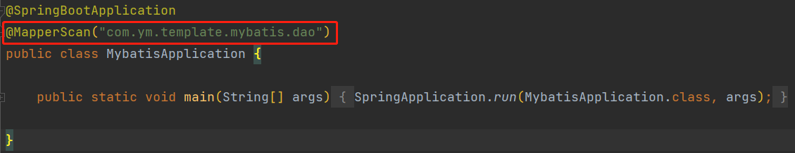
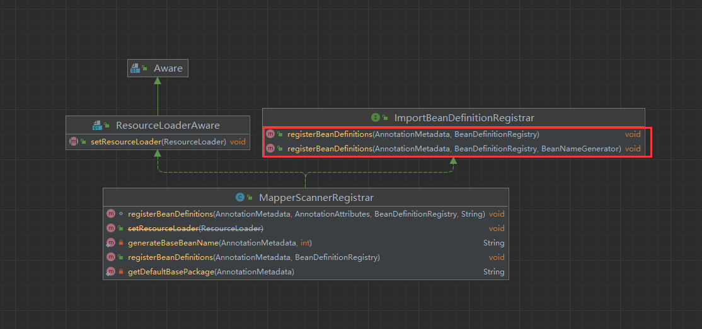
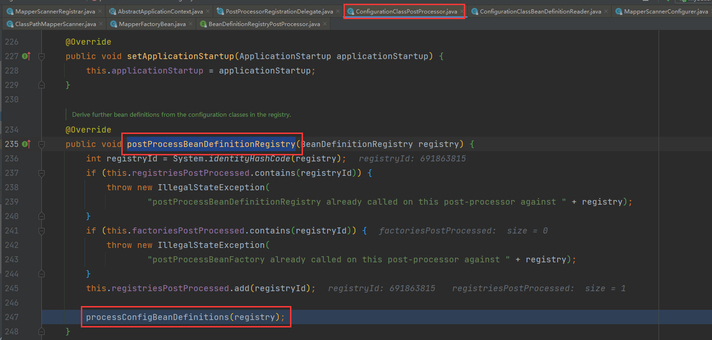
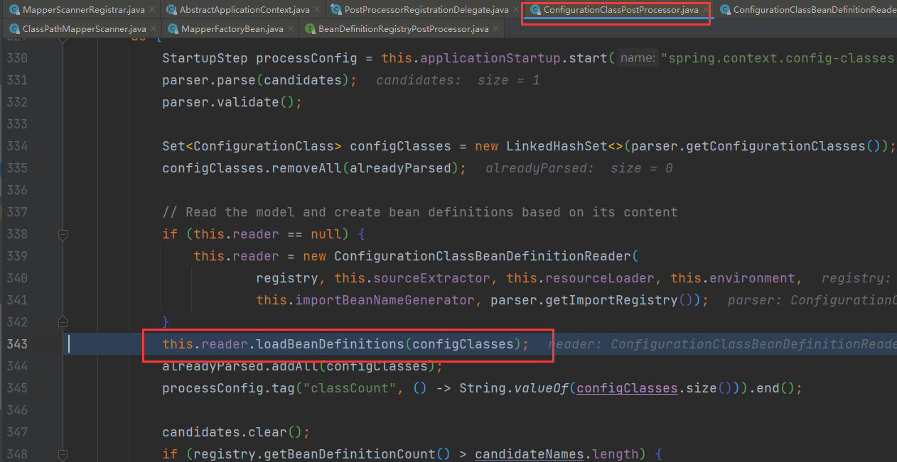
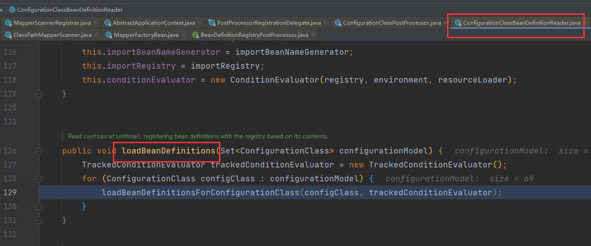
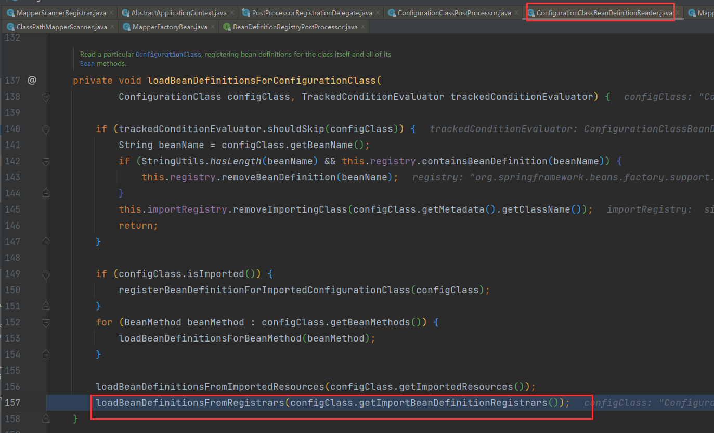
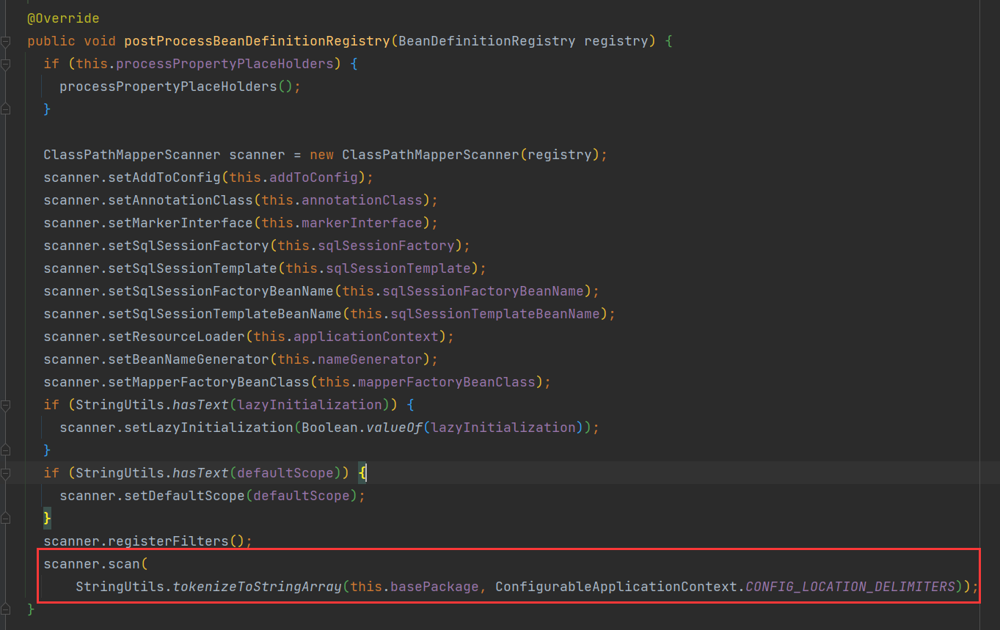
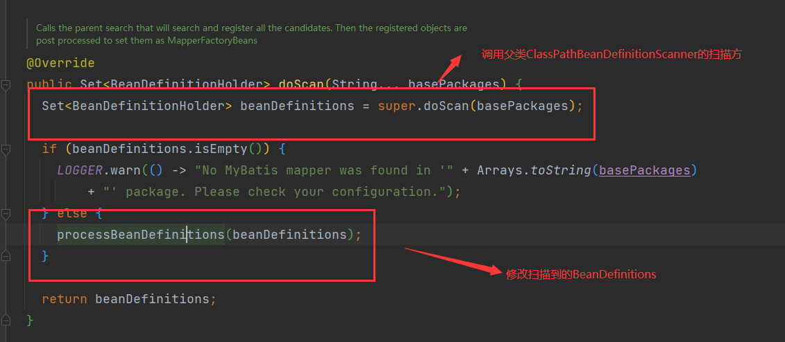
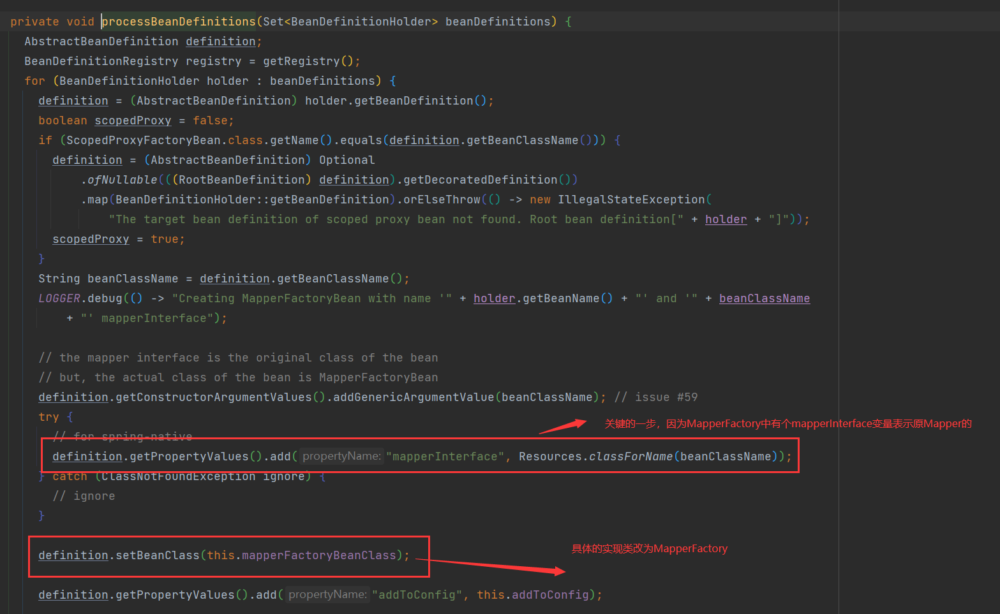

## MyBatis加载原理-Springboot篇

### 引入@MapperScan

在启动类或者其他Configuration类上引入@MapperScan

查看@MapperScan注解发现其引入了MapperScannerRegistrar类

关注其**ImportBeanDefinitionRegistrar**接口发现有一个方法**registerBeanDefinitionsregisterBeanDefinitions**

这个方法在ConfigurationClassPostProcessor中会被引用到

### 引入MapperScannerRegistrar

**MapperScannerRegistrar**在**registerBeanDefinitionsregisterBeanDefinitions**

注入了一个**MapperScannerConfigurerMapperScannerConfigurer**类

这个类实现了**BeanDefinitionRegistryPostProcessor**接口在springboot启动过程中会调用**postProcessBeanDefinitionRegistry**方法额外生成BeanDefinitions

**MapperScannerConfigurerMapperScannerConfigurer**在**postProcessBeanDefinitionRegistry**方法中扫描**@MapperScan**写入的mapper地址

**ClassPathMapperScanner**类作为实际扫描classPath中的mapper，并修改扫描的BeanDefinitions将其实现类改为**MapperFactoryBean**

以上几部完成了将Mapper类存储到BeanDefinitonRegistry中

### 实例化Mapper

